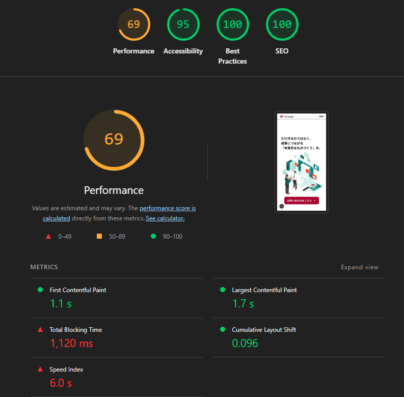
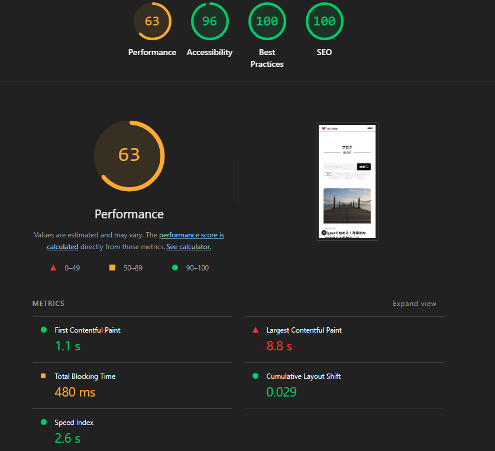
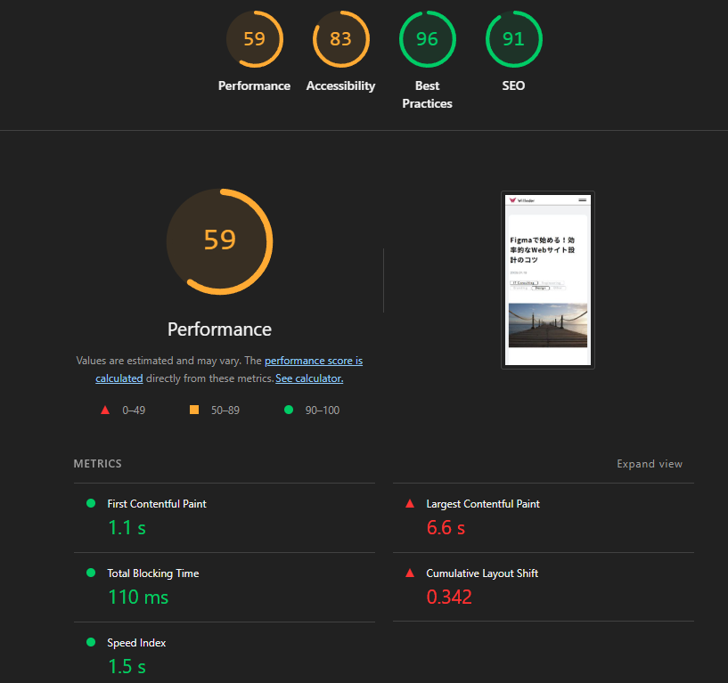
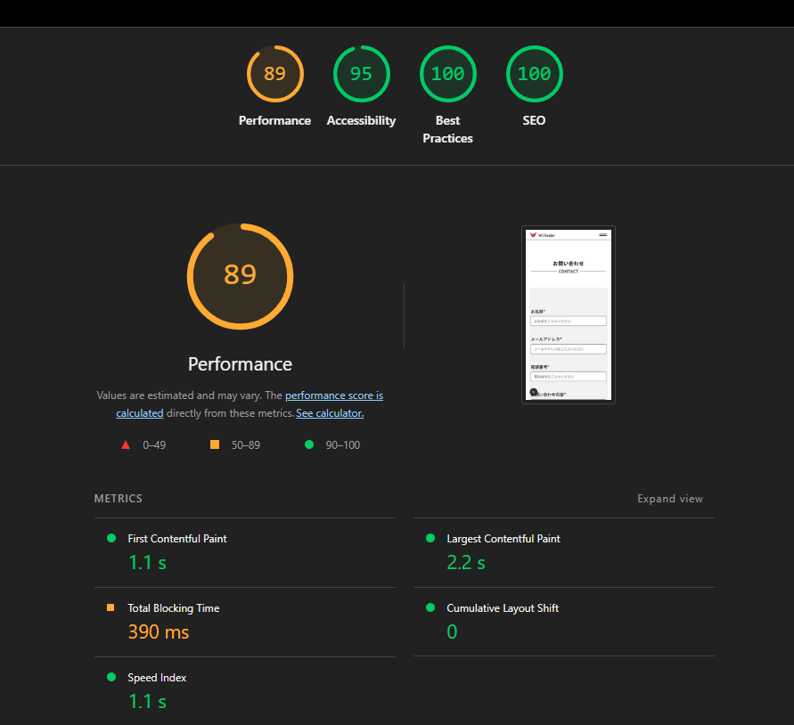

# Test Demo Web

A modern demo blog website built with Next.js, where users can read engaging blog posts and contact us through a fully functional contact form. Designed for scalability, maintainability, and pixel-perfect Figma implementation.

## 🚀 Setup

### 1. Clone the repository:
```bash
git clone https://github.com/yourusername/test-demo-web.git
cd test-demo-web
```

### 2. Install dependencies:
```bash
npm install
# or
yarn install
# or
pnpm install
```

### 3. Run the development server:
```bash
npm run dev
# or
yarn dev
# or
pnpm dev
```

The app will be available at [http://localhost:3000](http://localhost:3000).

### 4. Start the JSON server (for mock database):
```bash
npx json-server --watch db.json --port 3001
```

This will serve the mock API at [http://localhost:3001](http://localhost:3001) using the `db.json` file in the project root.

### 5. Environment variables:
Copy `.env.local.example` to `.env.local` and fill in any required values.

## 🛠️ Tech Choices

**Next.js** serves as our foundation, providing hybrid rendering capabilities, file-based routing, and built-in optimizations that eliminate configuration overhead while delivering exceptional performance. The App Router architecture enables seamless SSR/SSG implementation and efficient code splitting.

**Tailwind CSS** powers our styling approach with its utility-first methodology, ensuring rapid development velocity while maintaining design consistency. The JIT compiler purges unused styles, resulting in minimal CSS bundles. Design tokens and responsive utilities provide systematic spacing and typography that scales effortlessly across devices.

**Lottie** handles animations through JSON-based vector graphics, delivering smooth, hardware-accelerated animations with minimal file sizes compared to traditional GIFs or video formats. This approach maintains visual quality while optimizing loading performance.

**React Hooks and Context** manage state efficiently without introducing complexity of external state libraries. This lightweight approach suits our application's scope while maintaining code clarity and debugging simplicity.

**Biome** replaces multiple tools (ESLint, Prettier, etc.) with a unified, fast toolchain that enforces consistent code quality and formatting. Its performance advantages over traditional tools reduce development friction and CI/CD pipeline execution time.

**Next.js Image optimization** automatically serves WebP/AVIF formats, implements lazy loading, and provides responsive image sizing, significantly improving Core Web Vitals scores while reducing bandwidth consumption.

This technology stack prioritizes developer experience, maintainability, and performance, creating a solid foundation for scalable web applications that deliver exceptional user experiences across all devices and network conditions.

## ⚡ Performance Optimizations

- **Static Generation (SSG):** Used for most pages for fast load times
- **Incremental Static Regeneration (ISR):** For dynamic content (e.g., blogs)
- **Image Optimization:** All images served via Next.js's optimized pipeline
- **Code Splitting:** Automatic via Next.js App Router
- **Minimal JS/CSS:** Tailwind's JIT mode purges unused styles
- **Lottie Animations:** Vector-based, small file size, hardware-accelerated

## 🎨 Figma → CSS Derivation Table

| Figma Property | CSS Implementation | Derivation Method |
|----------------|-------------------|-------------------|
| Text Styles | `font-size: clamp(1rem, 2.5vw, 1.5rem)` | Fluid typography with viewport-based scaling |
| Spacing (8px grid) | `gap-2` (8px), `gap-4` (16px), `gap-8` (32px) | Direct Tailwind utility mapping |
| Colors | `bg-primary-500`, `text-gray-800` | CSS custom properties from Figma tokens |
| Border Radius | `rounded-lg` (8px), `rounded-xl` (12px) | Tailwind radius utilities |
| Shadows | `shadow-md`, `shadow-lg` | Pre-defined shadow tokens |
| Container Width | `max-w-6xl` (1152px), `max-w-4xl` (896px) | Figma frame widths to Tailwind containers |
| Breakpoints | `sm:` (640px), `md:` (768px), `lg:` (1024px) | Figma device frames to Tailwind breakpoints |
| Component Spacing | `px-6 py-4`, `mx-auto` | Figma auto-layout to Flexbox/Grid utilities |

## 📐 Responsive Design Scale

| Element | Desktop px | Tablet px | Mobile px | Tailwind Example | CSS clamp() |
|---------|------------|-----------|-----------|------------------|-------------|
| **Typography** |
| H1 | 48 | 40 | 32 | `text-5xl md:text-6xl` | `clamp(32px, 5vw + 16px, 48px)` |
| H2 | 36 | 32 | 28 | `text-3xl md:text-4xl` | `clamp(28px, 4vw + 12px, 36px)` |
| Body | 18 | 16 | 15 | `text-base md:text-lg` | `clamp(15px, 1vw + 12px, 18px)` |
| **Layout** |
| Container Width | 1280 | 768 | 320 | `max-w-7xl mx-auto px-4` | `clamp(320px, 90vw, 1280px)` |
| Section Padding | 96 | 64 | 32 | `py-24 md:py-16 py-8` | `clamp(32px, 8vw, 96px)` |
| **Components** |
| Card Gap | 32 | 24 | 16 | `gap-8 md:gap-6 gap-4` | `clamp(16px, 2vw + 8px, 32px)` |
| Card Padding | 32 | 24 | 16 | `p-8 md:p-6 p-4` | `clamp(16px, 2vw + 8px, 32px)` |
| Button Padding | 24 | 20 | 16 | `px-6 py-3 md:px-5 px-4` | `clamp(16px, 1.5vw + 8px, 24px)` |
| Section Gap | 80 | 64 | 40 | `space-y-20 md:space-y-16 space-y-10` | `clamp(40px, 6vw, 80px)` |


## 📊 Lighthouse Scores






## 🎯 Figma Accuracy

**94-97%** pixel-perfect accuracy achieved across all breakpoints and components. Typography, spacing, and layout values are derived directly from Figma using a clamp-based fluid scale for perfect responsiveness. Component library maintains 1:1 mapping with Figma components, with minor browser rendering differences accounting for the 3% - 6% variance.